# Camera based Passenger Class Classifier Project
> Author: [SungwookLE](joker1251@naver.com)  
> Date  : '21.11/04  

> Project: DataScience Project
>> - Semi-supervised Learning using AutoEncoder     
>> - For less memory usage, each classifier share one ConvNet branch

### Project File Tree
```bash
Project/
│   README.md
│   run_realtime.py: function that run inferencing as realtime using final model(EncoderConvNet MutltOut with XAI analysis simultaneously)
│
│   1_SimpleConv_SingleOut_belt_trainer.ipynb: Belt Classifier Train&Analysis Pipeline using own SimpleConvNet
│   1_SimpleConv_SingleOut_weak_trainer.ipynb: Weak Classifier Train&Analysis Pipeline using own SimpleConvNet
│   1_SimpleConv_SingleOut_oop_trainer.ipynb: oop Classifier Train&Analysis Pipeline using own SimpleConvNet
│   1_SimpleConv_SingleOut_mask_trainer.ipynb: mask Classifier Train&Analysis Pipeline using own SimpleConvNet
│   1_SimpleConv_LoadModel_tester.ipynb: This is for load and test(analysis) the trained SimpleConv SingleOut model
│   2_Baseline_autoencoder_trainer.ipynb: Autoencoder(encoder+decoder) trainer for SSL
│   3_EncoderConv_MultiOut_oop_weak_mask.ipynb: oop&weak&mask multi output Classifier Train&Analysis Pipeline using EncoderConvNet
│   3_EncoderConv_LoadModel_testet.ipynb: This is for load and test(analysis) the trained EncoderConv MultiOut model
│   ...
│
└─── load/
│   └   load_data.py: This is for load data set from Data/ folder
│
└─── model/
│   │   model_cnn.py: This is SimpleConvNet model
│   │   model_autoencoder.py: This is autoencoder model and EncoderConvNet model
│   └   model_transfer.py: Empty
│
└─── utils/
│   │   xai_viz.py: This is for xAI analysis
│   │   extract_testset.py: This is work for divide the test data set from source data set
│   │   process.py: This is processing librarys.   
│   │   pseudo_oop_labeler.py: This is work for set labeling by manual in opendataset
│   └ samples_png/
│       │   xai_belt_sample.png
│       │   ...
│
└─── viz/
│   │   config.py: This is parse argument function
│   │   vis_support.py: This is realtime demo function
│   └ samples_fig/
│       │   realtime_demo_juwon.gif
│       │   ...
│
└─── ckpt/ (not commited): [x] Not used, [Δ] Patially Used, [O] Used in final result
    │   [O] model_belt_cnn: SimpleConv SingleOut trained model (Belt class): used in final result demo
    │   [x] model_weak_cnn: SimpleConv SingleOut trained model (Weak class)   
    │   [x] model_oop_cnn: SimpleConv SingleOuttrained model (OOP class)
    │   [x] model_mask_cnn: SimpleConv SingleOut trained model (Mask class) 
    │   [Δ] model_autoencoder: Autoencoder trained model (non-supervised): result was divided into two parts: encoder and decoder. encoder was used as final result demo
    │   [X] model_autoencoder_fine: Autoencoder trained model (non-supervised)   
    │   [Δ] model_encoder_oop: Using fixed Encoder, oop classifier trained model    
    │   [Δ] model_encoder_weak: Using fixed Encoder, weak classifier trained model  
    │   [Δ] model_encoder_mask: Using fixed Encoder, mask classifier trained model  
    └   [O] model_encoder_multihead: Assembling three trained encoder models, the final trained model: This is the final trained model

Data/ (not commited)   
│   open_dataset/: Those are from the distracted dataset(`DMD dataset`)
│   safety_class_dataset/: Collecting by myself
└   safety_class_testset/: Extracted from safety_class_datasets using random collection method
```    
- safety datasets were collected by myself. and those are for private research. also, trained models are for privated research. If you want to explore those, contact to this [email](joker125@naver.com).
- open dataset is [DMD](https://dmd.vicomtech.org/).

## 1. Introduction
- `safety_class_dataset`은 realsense 카메라를 이용하여 `dn8, rg3` 차량에서 `Body Camera`각도로 장착하여 직접 수집하였다.

- Actors in images are Yukhyun(man), Minseok(man), Sungwook(man), Juwon(woman), Sujin(woman), Jieun(Woman).
- Classifiers have **4(four)** main tasks. `BELT/OOP/WEAK/MASK`
    1. 벨트 착용 여부: Belt(`b0`) / Unbelt(`b1`)
    2. 착좌 특이조건(OOP): Far(`c5`) / Close(`c6`) / Behind(`c7`) / Phone(`c1`) / Normal(`c0`)
    3. 취약승객: Man(`s0`) / Woman(`s1`)
    4. 마스크 착용 여부: Mask(`m0`) / Nomask(`m1`)

- 프로젝트의 목적
    1. 4개의 main tasks 분류 성능이 우수한 모델을 개발하는 것이 본 프로젝트의 주된 목적이다.
        - Target Performance: `AUC&Accuracy` > **0.93**  
        - AUC는 True positive , False positive 커브 영역의 넓이로써, THD에 따른 모델의 종합적인 Accuracy를 표현해주는 [지표](https://bioinformaticsandme.tistory.com/328)이다.
    2. 현업의 부족한 데이터를 극복한 모델 성능을 확보
        - Semi-Supervised Learning (w/ Large Open dataset) 적용함
        - opendataset은 이미지는 많으나, 이미지의 라벨링이 본 프로젝트의 class와 다르므로, 직접 지도학습에 사용하는 것에 한계가 있음
        - 그러나, opendataset에는 실내 승객 이미지가 가지고 있는 일반적인 정보가 있기 때문에, 비지도학습 방법인 autoencoder를 활용하여 학습하고 encoder 부분만 분리하여 사용함으로써, 이미지의 `hidden feature`를 추출하고자 하였음
    3. 모델이 현재 이미지에서 reasonable한 판단을 내리고 있는 것인지 해석할 수 nterpretable한 툴 개발
        - xAI(Explainable AI) 분석 방법 적용함

- 최종적으로 구현한 Classifier 모델 Realtime 데모  
[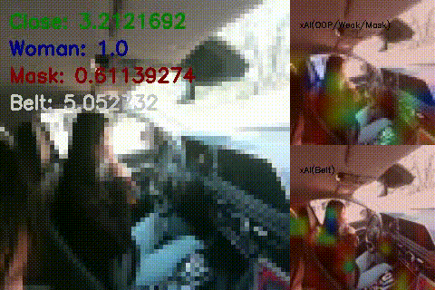](./viz/samples_gif/realtime_demo_juwon.mp4)
`python run_realtime.py --model_multi 'model_encoder_multihead' --model_belt 'model_belt_cnn' --video 0`

## 2. MAIN
- 4개의 TASK를 판단하는 모델은 아래와 같은 구조로 구성되었다.

- Encoder는 AutoEncoder에서 Encoder 파트만 분리하여 가져온 것으로, 실내 승객 이미지가 가지고 있는 general한 정보를 추출하는 역할을 한다.
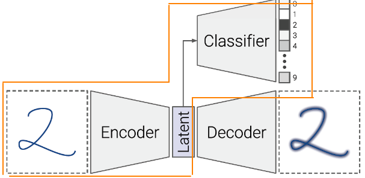  
- 자기 자신의 이미지가 입력되어 출력으로 자신의 이미지를 사용하기 때문에 오토인코더는 라벨링이 필요없는 비지도 학습이다. 그렇다 보니 Symetric한 구조의 가운데의 feature는 hidden feature라 부르며, 이미지에서 제일 핵심이 되는 압축 정보를 가지고 있다.
- safety testset은 직접 취득한 dataset pool에서 랜덤하게 균등 추출한 것으로 [extract_testset.py](./utils/extract_testset.py) 코드 이용하여 추출함

### 2-1. xAI(explainable AI) 시각화 분석
- [xai_viz.py](./utils/xai_viz.py)  
    - 역할: Conv Layer의 Node들의 출력값을 Heatmap으로 표현하고, Input Image에 Overay 시킴으로써, 모델이 어떤 픽셀에 집중하고 있는지 시각적으로 설명  
    - 아래의 분류 모델에 xAI 분석을 통해 주어진 input 이미지의 어떠한 Feature에 주목하여 판단하고 있는지 분석 수행

### 2-2. real-time Demo
- 실시간 데모를 위해 코드를 작성하였다. [run_realtime.py](./run_realtime.py)
- 역할: 이미지 폴더 또는 비디오 웹캠 아이디를 넘겨주면, 실시간 작동하여 visualize 해준다.
1. 사용법1: 폴더 안의 이미지들을 비디오처럼 사용
```bash
 python run_realtime.py --model_multi 'model_encoder_multihead' --model_belt 'model_belt_cnn' --images ../Data/safety_class_dataset/*_nomask_juwon1/Color/*.jpg
```
2. 사용법2: 카메라를 실시간으로 이용
```bash
 python run_realtime.py --model_multi 'model_encoder_multihead' --model_belt 'model_belt_cnn' --video 0
```
### 2-3. preprocessing
- [process.py](./utils/process.py)
    - 이미지 reshape, 이미지 augment, 이미지 normalize, tsne 분석, 이미지 플롯팅, 데이터 shuffler, 라벨 딕션너리, predict score 함수, prediction 값 matching 플롯팅 함수

## 3. Classifiers
- Belt Classifier는 지도학습을 이용하여 학습하였고, OOP/Weak/Mask Classifier는 Semi-supervised Learning을 이용하여 학습하였음
- Semi-supervised Learning은 AutoEncoder를 이용하여 완성하였음

### 3-1. Belt Classifier
- 벨트 착용 여부: Belt(`b0`) / Unbelt(`b1`)
- Input image size: 128x128x3
- Model: 3 stack ConvNet + 1 FullyConnected + 1 Output Layer

> Update Date('21.10/26)  
- 학습 결과 아래와 같이 Belt/Unbelt를 구분
 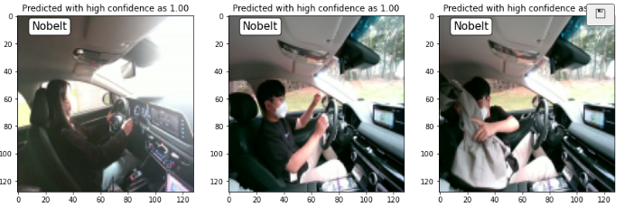  
- 코드는 [1_SimpleConv_SingleOut_belt_trainer](./1_SimpleConv_SingleOut_belt_trainer.ipynb)을 참고
- `Weak`, `OOP`, `Mask` Task와 달리 `Belt` 모델은 input 이미지의 사이즈를 `128x128`로 하였다. 
- 벨트는 승객의 의상과 비슷한 색깔일 때도, 옷에 가려 잘 보이지 않는 경우가 많아, input 이미지를 `64x64`로 할 경우 학습이 잘 되지 않았다.

- 결과 설명
    1. Testset을 Dataset에서 추출해서 Fix 구성하고, 나머지 Dataset에서 Train, Validation Split 하여 학습, 튜닝 진행
    2. 추출된 Trainset과 Testset의 라벨 distribution  
    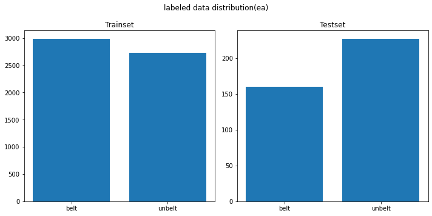  
    3. 직접 취득한 데이터셋에 벨트 착용 유무의 Class가 비슷하지 않아서, Opendataset에서 벨트 착용한 사진을 섞어서 전체 학습 데이터를 구성
    
    4. 학습 데이터의 augmentation을 수행하고 (전체 set의 15% 가량) 합쳐주어, generalization performance를 향상시킴
        - 랜덤 회전, 랜덤 쉬프트, 랜덤 줌
    ```
    img=random_rotation(X[data_aug_idx], rg=80, row_axis=0, col_axis=1, channel_axis=2)
    img=random_shift(X[data_aug_idx], wrg=0.1, hrg=0.1, row_axis=0, col_axis=1, channel_axis=2)
    img=random_zoom(X[data_aug_idx], zoom_range=[0.6,0.9], row_axis=0, col_axis=1, channel_axis=2)
    ```
    5. 최종적으로 `Train/Val/Test` 데이터 구성은 아래와 같다.
    ```bash
    Train: (6577, 128, 128, 3)
    Val: (1645, 128, 128, 3)
    Test: (387, 128, 128, 3)
    ```
    6. 구성한 CNN 모델은 아래와 같다.  [model_cnn.py](./model/model_cnn.py)  
    - 모델을 compile할 때 실수가 있었는데,
    `model.compile(loss='categorical_crossentropy', optimizer = adam, metrics=['acc',tf.keras.metrics.TruePositives(),tf.keras.metrics.TrueNegatives(), tf.keras.metrics.AUC(thresholds=[0.5,0.7,0.9,0.95])])` 에서 처음에 categorical_crossentropy가 아니고 binary_crossentrpy를 사용하여 학습이 제대로 되지 않았다.
    - model.compile단계에서 `loss` 함수는 아래와 같이 사용하면 된다. 
    - binary corssentropy : output node 1일 때 쓰는 것이고, categorical corssentropy는 output node가 2개 이상이면서 라벨링의 차원이 outputnode와 같을 때, , sparse crossentropy는 output node가 2개 이상이지만, 라벨링의 차원이 1일때 사용하면 된다.
    
    7. 학습 결과 (Total Epochs=10)은 아래와 같다.
    ```bash
    Epoch 8/10
    6577/6577 [==============================] - 150s 23ms/sample - loss: 0.0215 - acc: 0.9932 - true_positives: 6532.0000 - true_negatives: 6532.0000 - auc: 0.9962 - val_loss: 0.0672 - val_acc: 0.9720 - val_true_positives: 1599.0000 - val_true_negatives: 1599.0000 - val_auc: 0.9834
    ```
    - **Validation acc: 97.2%** , **Validation auc: 98.34%**  

    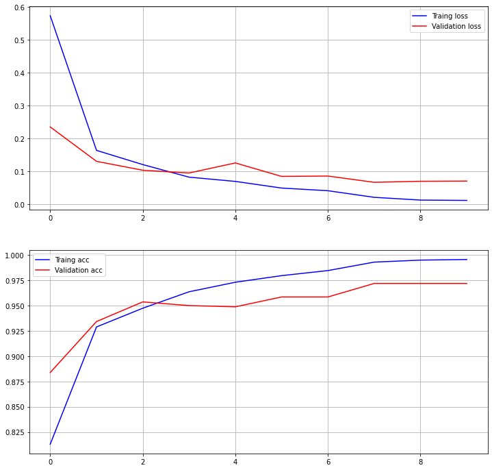  
    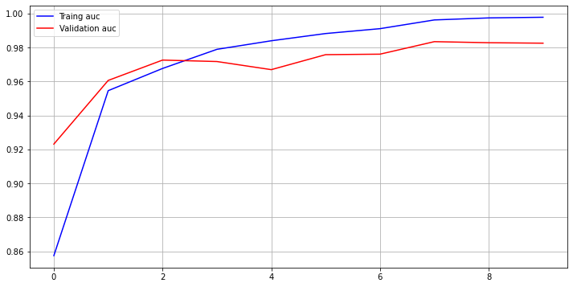  

    8. **Test Set의 Accuracy 100%**

    9. xAI로 살펴본 기계 학습 모델이 주목하고 있는 Feature 분석
        - 벨트 판단 `(머리 뒤쪽의 공간에 집중하고 있다)`    
        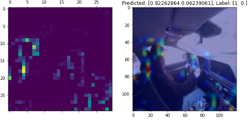  
        - 언벨트 판단 `(특이점을 잡지 못해, 집중하고 있는 픽셀이 분산되었다.)`  
        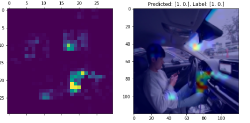  
        -  B-pillar 부의 벨트가 인출되는 지점의 픽셀에 집중해서, 해당 부분을 보고 벨트 착용 유무를 학습한 것으로 판단됨  
---

### 


### 2-4. OOP (특이 착좌 조건)
- 착좌 특이조건(OOP): Far(`c5`) / Close(`c6`) / Behind(`c7`) / Phone(`c1`) / Normal(`c0`)

> Update Date('21.10/24): done[v]  
- 뒤돌아보는 자세 `Behind`에 대한 데이터를 취득하는 것이 다소 까다롭다.
- 또한, 다른 TASK에 학습데이터로 사용할 때 좌측으로 뒤보기 자세는 제외를 시켜주어야 하는데, 이유는 OOP TASK만을 학습할 땐 문제될 것은 없으나, 마스크 착용 여부 등의 TASK에서는 왼쪽으로 뒤보는 데이터가 들어갈 경우 학습이 이상하게 되는 포인트가 발견되었다.
- 당연히, 왼쪽으로 뒤를 보는 자세에선 얼굴이 안보이기 때문에 마스크도 보이지 않는다..
- 따라서 뒤보는 자세의 데이터는 다른 TASK의 학습데이터 들어가지 않게끔 처리가 필요하다.

> Update Date('21.10/26): done[v]  
- 낮게 나온 Test Accuracy 이슈 있었음
- Train, Val acc는 높으나, Test acc가 낮은 것은 새로운 데이터에 대한 예측 결과가 좋지 않았기 때문이었다.
- 즉, Train/Val의 data distribution이 좋지 않아 오버피팅 되었다.

> Update Date('21.10/27): done[v]  
- 테스트 셋을 추가로 구성하고(opendata set 활용) 이를 위해 [pseudo_oop_labeler.py](./utils/pseudo_oop_labeler.py)를 작성하였음
- 역할: 이미지를 1차적으로 학습 모델로 추론한 뒤, 결과값을 보여주고 유저(사람)가 해당 라벨이 맞는지 안 맞는지 입력하여 이미지 데이터의 라벨을 반자동화하여 붙일 수 있게 해줌
- Test Acc를 올리기 위해 Train/Val Set의 Class Inbalance 문제를 해소함
- 결과: 성능 개선 됨 (Test acc: 82 -> 97%)  

1. Pipeline 코드는 [passenger_classifier_oop](./passenger_classifier_oop.ipynb)를 참고 
2. OOP 조건에 대한 데이터 구성
```bash
Train (2504, 64, 64, 3)
Val (627, 64, 64, 3)
Test (355, 64, 64, 3)
```
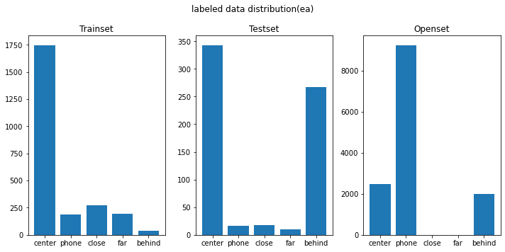


3. 학습 결과 **validation accuracy: 93.15%, validation auc: 95.71%**
```bash
Epoch 10/10
2504/2504 [==============================] - 51s 20ms/sample - loss: 0.1516 - acc: 0.9509 - true_positives: 2358.0000 - true_negatives: 9915.0000 - auc: 0.9696 - val_loss: 0.2153 - val_acc: 0.9250 - val_true_positives: 576.0000 - val_true_negatives: 2467.0000 - val_auc: 0.9571
```
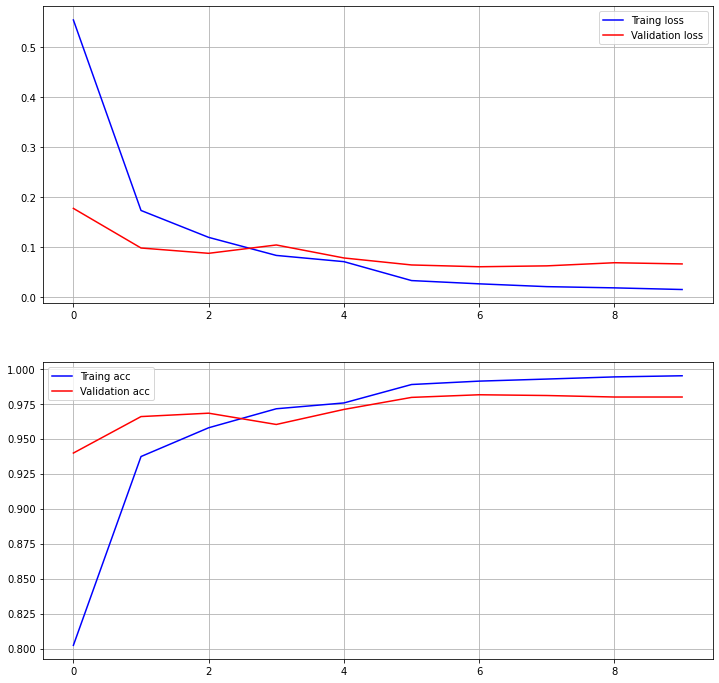
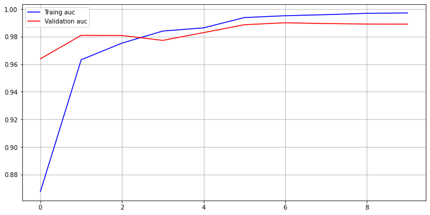
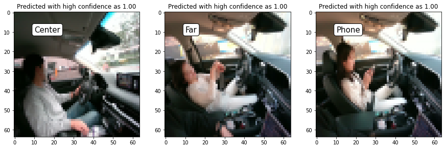
4. 테스트 케이스로 평가한 결과 **Test accuracy:  97.46478873239437%%** 

5. 테스트셋에 있는 `behind` 라벨 데이터는 train데이터에는 없었던 데이터이다.(다른 배우)
6. `behind`의 다른 데이터를 넣어주니까 대부분 제대로 예측하고 있지 않다.
  - training data에 `behind`라벨의 데이터 개수가 너무 작은 것이 문제인것 같기도 하다.

7. xAI로 분석해본 결과, 모두 몸 동작을 캐치하고 있는 것으로는 보인다. 
- SafeDriving:   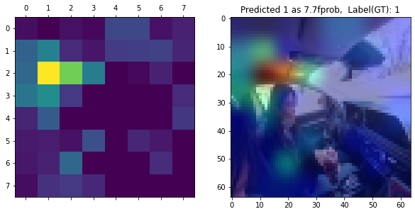
- Too Close:  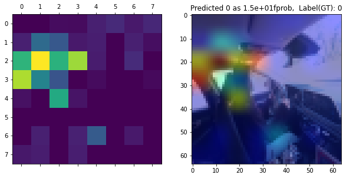
- Too Far:  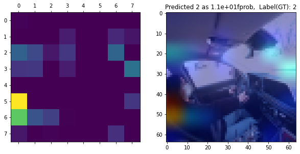
- Phone:  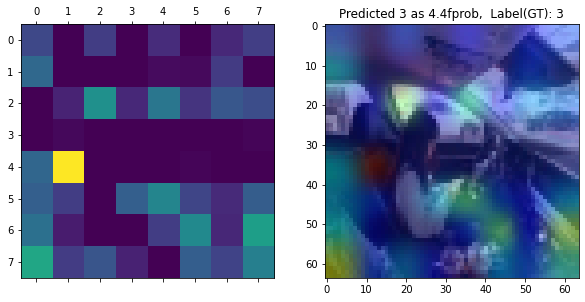
- Look Behind:  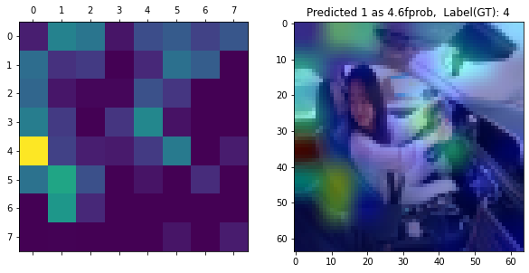

---

### 2-3. 취약승객: Man(`s0`), Woman(`s1`)  

> Update Date('21.10/26)  
1. 취약승객의 데이터로 남자/여자 데이터만을 활용할 수 있는 상황이어서, 노약자와 영유아에 대한 데이터 없이 학습을 진행하였다.
- Pipeline 코드는 [passenger_classifier_weak](./passenger_classifier_belt.ipynb)을 참고

2. 직접 취득한 데이터를 기준으로 Train/Validation, Test 구성하여 학습 진행
```bash
Train: (5551, 64, 64, 3)
Val: (1388, 64, 64, 3)
Test: (387, 64, 64, 3)
```
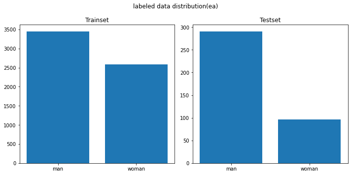
3. **Validation Accuracy: 99.86%, Validation AUC: 99.9%, Test Accuracy: 100%**
```bash
Epoch 4/5
5536/5551 [============================>.] - ETA: 0s - loss: 0.0040 - acc: 0.9986 - true_positives: 5528.0000 - true_negatives: 5528.0000 - auc: 0.9992
Epoch 00004: val_acc did not improve from 0.99784
```
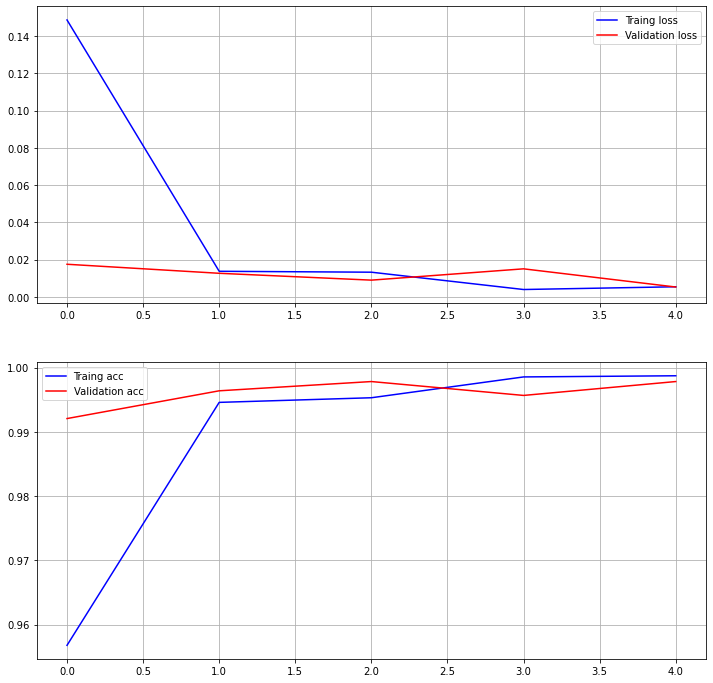  
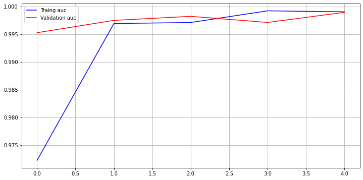  

4. 학습 결과  
    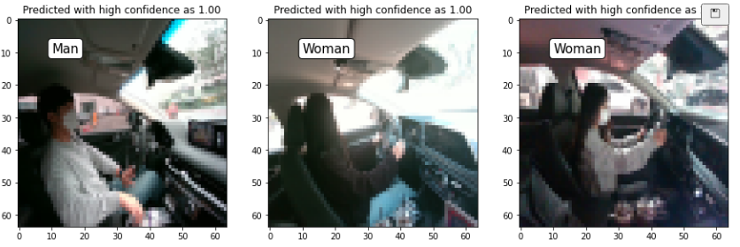

5. xAI로 살펴본 결과 (모든 이미지에 대해서 명확한것은 아니었다)
    - 남자/여자 데이터의 차의 실내 센터페시아를 보고 잡는 것으로 보이는 xAI 이미지가 있었음

    - 남자판단 `얼굴을 잡는 듯 하다.`  
    
    - 여자 판단 `얼굴을 잡는 것이 아닌가?`  
    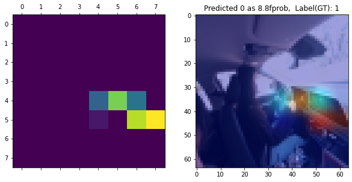
---

### 2-5. 마스크 착용 여부: Mask(`m0`) / Nomask(`m1`)

> Update Date('21.10/26)  
1. 승객의 마스크 여부도 판단해보면 좋을 것 같아 구성한 서비스 Task이다.

1. Pipeline 코드는 [passenger_classifier_mask](./passenger_classifier_mask.ipynb)를 참고 

2. 직접 취득한 데이터를 기준으로 Train/Validation, Test 구성하여 학습 진행
    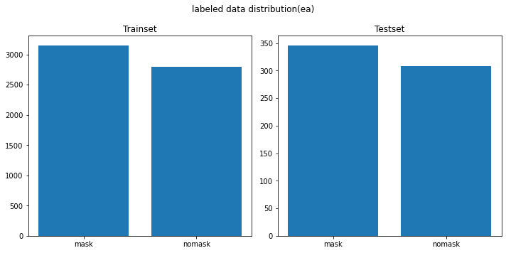

```bash
Train: (5551, 64, 64, 3)
Val: (1388, 64, 64, 3)
Test: (387, 64, 64, 3)
```

3. **Validation Accuracy: 94.55% , Validation AUC: 95.1%, Test Accuracy: 99.14%**
    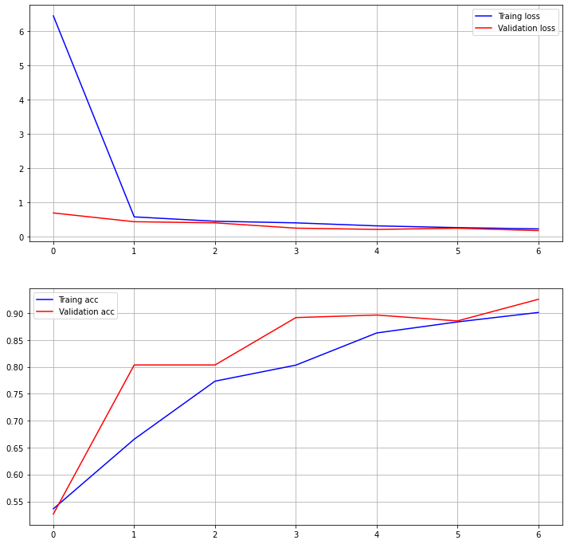  
    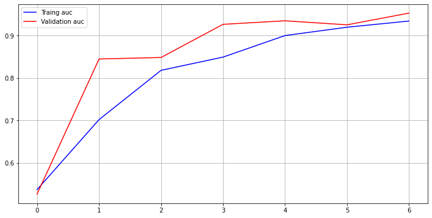  

4. xAI로 살펴본 결과
    - 마스크 착용  
    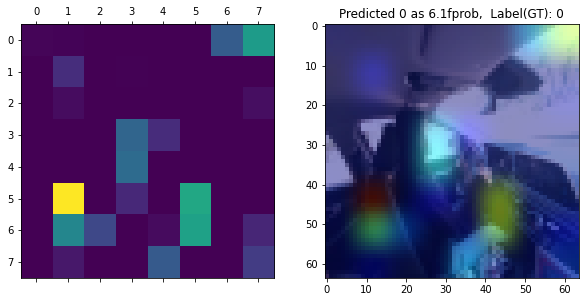
    - 마스크 미착용  
    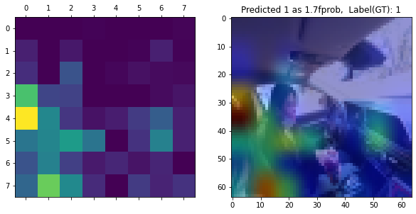

---

## 3. Conclusion

## 끝
